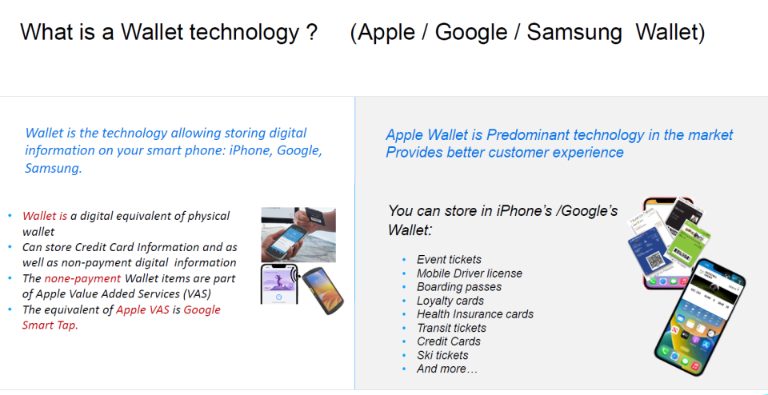

# Apple VAS デモガイド

[Apple VAS SDK 1.0 Demo](https://techdocs.zebra.com/nfc-vas/1-0/guide/demo/)

ECP1.0/2.0テクノロジーを使用して、Apple VAS にZebra Android デバイスが対応していることを証明するデモとなります。具体的にはiPhone Wallet 内のNFCパスをZebra デバイスで受信するものとなります。
         

## 端末の準備

1. デモ用端末を用意する。

   a. 下記機能を有するApple iPhone
      - Apple Wallet 
      - NFC 通信機能
  
   b. Zebra Android 端末*  

      \* A-VAS SDK に対応しているもの

     

## Apple Passのインストール

1. iPhoneをインターネット接続できる状態にする
   
2. カメラで下記QRコードをスキャンする。
   
    

3. URLが表示されたら、選択。
   
4. 画面表示のガイドの通り処理を進め、Apple Passの登録をする。

     

## Zebra VAS Demo ソフトのインストール

1. "Apple VAS SDK package"をダウンロードし、解凍する。
   
    [Apple VAS Package ダウンロード](https://www.zebra.com/us/en/support-downloads/software/developer-tools/value-added-services-sdk.html)

2.  下記apkをZebra デバイスにインストールする。

    - ZebraVasService-release-V-x.x.x.apk
    - Demo-app-release.apk
  
     

## デモ手順

1. Zebra デバイスでNFC Ticket Demo アプリを起動する。
   

     

2. iPhone で Apple Walletを起動し、デモ用にインストールしたパスを表示する。

    

     

3. iPhoneをZebra端末のNFCリーダとバンプさせる。

   1. 読み取り成功時の画面。

        
        

         

    1. 読み取り失敗時の画面。
   
        

